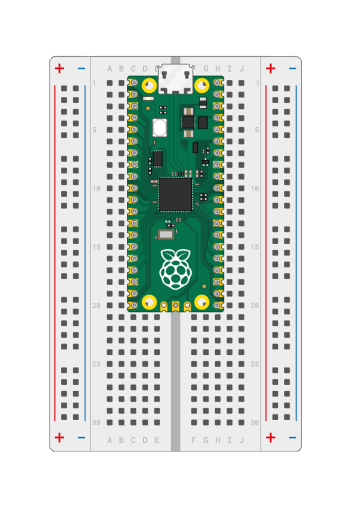

<h1>IOMT-Heart-rate-monitor</h1>
Devices like apple watches and fit bits track your heart rate all the time. This project tracks your pulse and keep it under your own encrypted atSign using IOMT.

<h2><u>Setting Up Raspberry Pi Pico W (Software)</u></h2>

Almost all files in this walkthrough are located in the <code>PicoProject</code> directory.

<h3>Required Parts:</h3>
<ul>
<li>A <a href="https://www.canakit.com/raspberry-pi-pico-w.html" rel="nofollow">Raspberry Pi Pico W</a> and <a href="https://m.media-amazon.com/images/I/61kT7kpt2hL._AC_SY450_.jpg" rel="nofollow">a data micro-USB to USB-A cable</a> (to connect your Pico to your Computer)</li>
<li>KS0015 Keyestudio Pulse Rate Monitor</li>
<li>Red LED</li>
<li>Breadboard</li>
<li>Connecting wires</li>
<li>220Ω Resistor</li>
<li>2, 1 x 20 PCB Headers</li>
</ul>
<h3>Other Requirements:</h3>
<ul>
<li>Soldering iron and solder</li>
<li><a href="https://code.visualstudio.com/Download" rel="nofollow">VSCode</a> with the <a href="https://marketplace.visualstudio.com/items?itemName=paulober.pico-w-go" rel="nofollow">Pico-W-Go extension</a></li>
<li><a href="https://filezilla-project.org/" rel="nofollow">FileZilla</a> or any other FTP software.</li>
<li>One <a href="https://my.atsign.com/go" rel="nofollow">atSign</a> and its <a href="https://www.youtube.com/watch?v=2Uy-sLQdQcA&amp;ab_channel=Atsign" rel="nofollow">.atKeys file</a></li>
</ul>

<h3>Installing Firmware to Pico W</h3>
<ol dir="auto">
<li>
Go to <a href="https://github.com/atsign-foundation/micropython/releases">atsign-foundation/micropython/releases</a> and download the <code>.uf2</code> file specially built to allow a certain encryption that Atsign uses (AES-256 CTR mode) to work on the Pico W.
</li>
<li>
Unplug the Pico W from your computer. Hold down the BOOTSEL button on the Pico W and then plug back the Pico W into your computer while holding down the BOOTSEL button. Once the Pico W is plugged in, you can let go of the BOOTSEL button. The Pico W should now be in bootloader mode.
</li>
<li>The Pico W should now appear as a storage drive on your computer. Check to confirm this.</li>
<li>From the <code>firmware</code> directory, drag and drop the file <code>firmware.uf2</code> into the Pico W directory. This should reboot the Pico W and it should be able to connect to VSCode after a few seconds.</li>
<li>Make sure the <code>PicoProject</code> directory is the primary directory that you are working out of in VSCode. Open the command palatte with <code>Ctrl + Shift + P</code> and select <code>Configure Project</code>.</li>
</ol>

<h3>Connecting to WiFi</h3>
<ol>
<li>Open the <code>settings.json</code> file and enter your WiFi SSID and password in the quotes.</li>
<li>Run the file called <code>test_1_wifi.py</code> using Pico-W-Go. You should see:
 <code>Connecting to Soup (Ctrl+C to stop)...
 Connected to WiFi Soup: True</code></li>
</ol>

<h3>Authenticating atSign Server</h3>
<ol>
<li>Change the name of the atsign in the <code>settings.json</code> file to the atsign you will be using for the device.</li>
<li>With Pico-W-Go installed in VSCode and, open the command palatte with <code>Ctrl + Shift + P</code> and upload all files in the <code>PicoProject</code> directory to the Pico W.</li>
<li>Open the command palatte again and select <code>Start FTP Server</code>. This will start an FTP server on the Pico W that you can connect to via FileZilla using the given address. When in FileZilla, create a new directory in the Pico W, call it <code>keys</code>, and drag and drop your .atKeys file containing the atKey that you want to use for the Pico W into the directory.</li>
<li>Close the FTP server by clicking "Stop" in the VSCode menu on the bottom left toolbar.
<li>Run the file <code>test_2_find_secondary_address.py</code> and <code>test_3_initializing_keys.py</code> to find the address and initialize the atKey.</li>
<li>If you start up the FTP server and look inside the <code>keys</code> directory now, you should see new directory with the same name as your atSign. Make sure to close the server again if you started it.</li>
<li>Run <code>test_4_pkam_authenticate.py</code> to test PKAM authentication. PKAM authentication is essentially authenticating ourselves to the server so we can run commands like updating, deleting, and seeing values. Press "y" when asked to run, the output should eventually indicate <code>data:success</code></li>
</ol>

<h2><u>Setting Up Raspberry Pi Pico W (Hardware)</u></h2>
<ol>
<li>Set up the Pico W and headers on the breadboard as pictured below and solder the Pico W to the headers.</li>

<li>With the Pico W on the breadboard, attach the connector on the Keyestudio Pulse Monitor labeled G (ground) to j-3 (column j, row 3) of the breadboard. Attach the connector labeled V to j-5, and S to j-7</li>
<li>Connect the resistor to a-18 and the ground (-) in the same row.</li>
<li>Connect the LED to a-20 and the ground in the same row.</li>
 

<h2><u>Using Raspberry Pi Pico W</u></h2>
<ol>
<li>Press thumb or finger on the pulse sensor module, preferably covered or in a dark area.</li>
<li>Run <code>heart_rate_monitor.py</code></li>
<li>Wait for program to complete, then continue to "Usage for GUI"
</ol>
 

<h2><u>Usage for GUI</u></h2>

Files in this walkthrough are located in the JavaGUI directory.

 Step 1: Login with your own atsign and the machine you wish to connect with. Must include an key directory along with they applicable atkeys. If any information was entered incorrectly the user will be prompted,

Step 2: Start the measurement of the heartrate on the heartrate sensor and after 30 seconds retrieve the data from the heartrate machine by pressing the start button.
 
Step 3: User has a option to save the last registered bpm to their own encrypted atsign.

